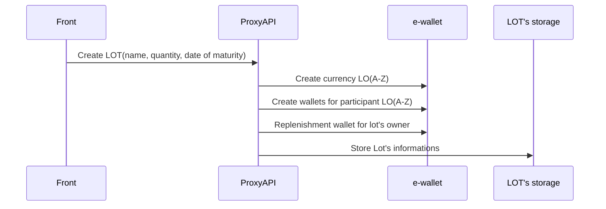
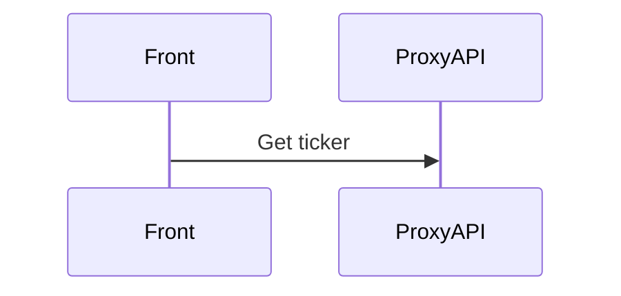

# Block Factoring Proxi API

## Start

    clone
    docker-compose up
    docker exec -it proxyapi_app_1 composer install
Create a lot.

Show lots

All things we will store here except DepthOfMarket

апи список кошельков упорядочить по названию и типу
пусттые кошелькии можно не показывать

tickers = contracts

profitability = (((cancellation price - current price) / current price) / days to cancellation) * 365   = % per year
