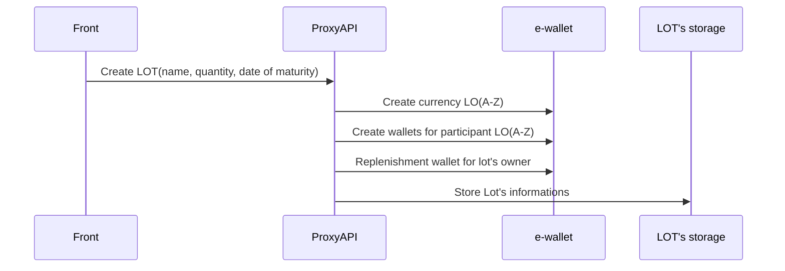
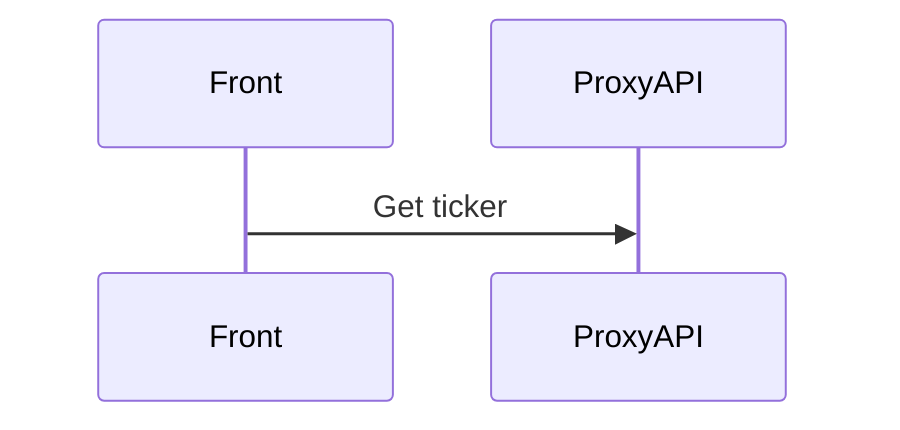

# Block Factoring Proxi API

Create a lot.

```mermaid
sequenceDiagram
    Front->>ProxyAPI: Create LOT(name, quantity, date of maturity)
    ProxyAPI->>e-wallet: Create currency LO(A-Z)
    ProxyAPI->>e-wallet: Create wallets for participant LO(A-Z)
    ProxyAPI->>e-wallet: Replenishment wallet for lot's owner
    ProxyAPI->>LOT's storage: Store Lot's informations
```
Show lots

```mermaid
sequenceDiagram
    Front->>ProxyAPI: Get ticker
```